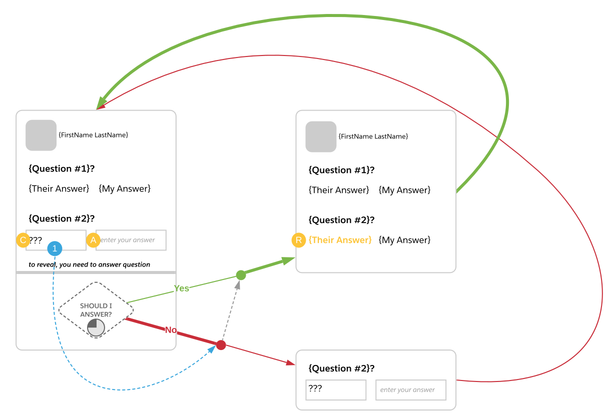

# Quest
## Challenge
- How Might We Improve An Employeee, Partner, or Customer Community Member Experience?
## Opportunity
- Give Community Members Incentives to Learn About Each Other
## Design
When a user (User A) visits the profile of another user (User B). User A will see a list of questions that either both users have answered OR questions that User B has answered. If User B has answered a question but User A has not, User A will not see User B's answer. User A can reveal User B's answer by answering the question.

